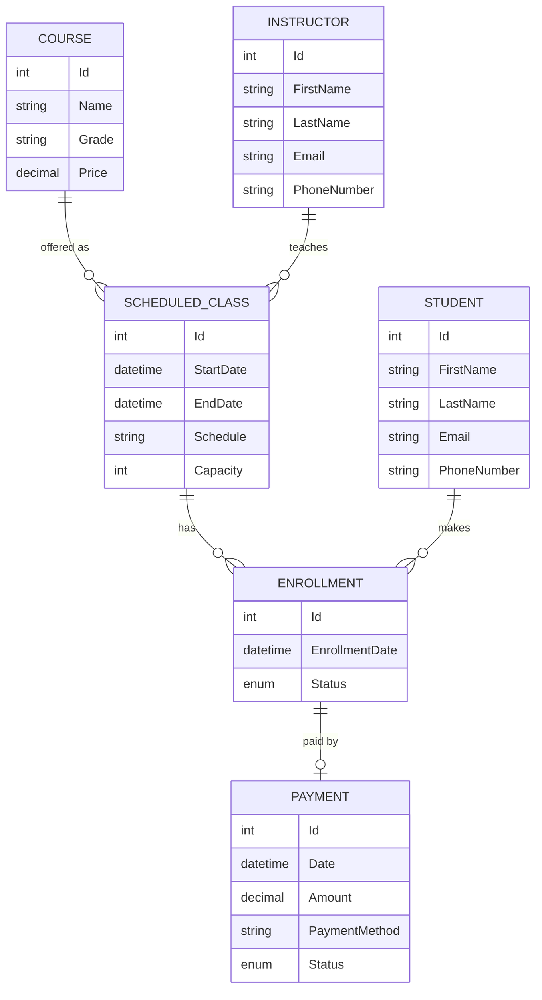

# 🎓 Educational Center

A management system for an educational center, built with **ASP.NET Core** on **.NET 10**. It handles courses, scheduled classes, instructors, students, enrollments, and payments, and it ships with two front ends over the same business logic:

- a **REST API** documented with Swagger/OpenAPI
- a small **Razor Pages** UI for day-to-day use (students, courses, classes, instructors, enrollment, payments)

The project is organized around **Clean Architecture**, the **Repository + Unit of Work** patterns, and centralized error handling.

---

## 🛠️ Tech Stack

| Area | Technology |
| :--- | :--- |
| Framework | ASP.NET Core (.NET 10) – Web API + Razor Pages |
| Language | C# (nullable reference types enabled) |
| Database | Microsoft SQL Server |
| ORM | Entity Framework Core 10 (code-first migrations) |
| Mapping | AutoMapper 16 |
| API docs | Swagger / OpenAPI (Swashbuckle) |
| UI | Razor Pages, Bootstrap, jQuery validation |

---

## 🏛️ Architecture

The solution is split into four projects. Dependencies point inward: the web and infrastructure layers depend on Core, never the other way around.

```
EducationalCenter.sln
├── EducationalCenter.Core            # Entities, enums, repository / service abstractions
├── EducationalCenter.Shared          # DTOs and domain exceptions
├── EducationalCenter.Infrastructure  # EF Core DbContext, configurations, migrations,
│                                     # repositories, Unit of Work, EnrollmentService
└── EducationalCenter.web             # API controllers, Razor Pages, AutoMapper profile,
                                      # exception middleware, Program.cs
```

| Layer | Responsibility |
| :--- | :--- |
| **Core** | Domain entities (`Student`, `Instructor`, `Course`, `Class`, `Enrollment`, `Payment`), enums (`EnrollmentStatus`, `PaymentStatus`), and the abstractions `IRepository<T>`, `IStudentRepository`, `IUnitOfWork`, `IEnrollmentService`. |
| **Shared** | Request/response DTOs (C# records) and the exceptions `NotFoundException`, `BadRequestException`, `ConflictException`. |
| **Infrastructure** | `AppDbContext`, entity configurations, migrations, generic `Repository<T>`, `StudentRepository`, `UnitOfWork`, and `EnrollmentService` (the enrollment business rules). |
| **Web** | Controllers under `/api`, Razor Pages, `MappingProfile`, and `ExceptionMiddleware`. |

---

## ✨ Key Features and Business Rules

**Enrollment** (`EnrollmentService`)
- The student and the class must both exist (`404` otherwise).
- A student cannot enroll in the same class twice (`409 Conflict`). This is also enforced by a unique index on `(StudentId, ClassId)`.
- A class cannot exceed its capacity. Seats are counted from `Active` enrollments (`400 Bad Request` when full).

**Validation**
- **Courses:** a name is required and the price must be greater than zero.
- **Classes:** capacity must be positive, the end date must be after the start date, and the referenced course and instructor must exist.
- **Instructors:** first name, last name, and email are required.
- **Payments:** the amount must be positive, the enrollment must exist, and the status must be `Completed`, `Pending`, or `Failed`.

**Data integrity**
- All foreign keys use `DeleteBehavior.Restrict`, so records that still have dependents are never silently cascade-deleted.
- Money columns use `decimal(18,2)`.
- Each enrollment is intended to have at most one payment (unique index on `Payment.EnrollmentId`).

**Reporting endpoints**
- `GET /api/Classes/schedule`: every class with course name, instructor name, capacity, enrolled count, and available seats.
- `GET /api/Classes/{id}/students`: the roster of a class.
- `GET /api/Students/{id}/payments`: a student's payment history with class and course names.

**Centralized error handling**

`ExceptionMiddleware` catches every unhandled exception, logs it, and returns a consistent JSON body:

```json
{ "statusCode": 404, "error": "NotFoundException", "message": "Student with ID 7 was not found." }
```

| Exception | HTTP status |
| :--- | :--- |
| `NotFoundException` | `404 Not Found` |
| `BadRequestException` | `400 Bad Request` |
| `ConflictException` | `409 Conflict` |
| anything else | `500 Internal Server Error` (generic message outside Development) |

**DTO mapping**

Controllers never expose entities. AutoMapper maps entities to response DTOs and request DTOs to entities, which prevents over-posting and circular-reference problems.

---

## 🗄️ Data Model



| Relationship | Meaning |
| :--- | :--- |
| Course → Class (1:N) | One course can be offered in many scheduled classes. |
| Instructor → Class (1:N) | One instructor can teach many classes. |
| Student → Enrollment (1:N) | A student can enroll in many classes. |
| Class → Enrollment (1:N) | A class holds many enrollments, up to its capacity. |
| Enrollment → Payment (1:0..1) | An enrollment has at most one payment, created through the Payments endpoint. |

**Enums:** `EnrollmentStatus` = `Active`, `Completed`, `Canceled` · `PaymentStatus` = `Completed`, `Pending`, `Failed`

---

## 📋 API Reference

Base path: `/api`. Interactive docs are served at `/swagger` in the Development environment.

### Students
| Method | Route | Description |
| :--- | :--- | :--- |
| `GET` | `/api/Students` | List all students. |
| `GET` | `/api/Students/{id}` | Get one student. |
| `POST` | `/api/Students` | Register a new student. |
| `GET` | `/api/Students/{id}/payments` | **Report:** the student's payment history. |

### Courses
| Method | Route | Description |
| :--- | :--- | :--- |
| `GET` | `/api/Courses` | List the course catalog. |
| `GET` | `/api/Courses/{id}` | Get one course. |
| `POST` | `/api/Courses` | Create a course. |
| `PUT` | `/api/Courses/{id}` | Update a course. |
| `DELETE` | `/api/Courses/{id}` | Delete a course. |

### Classes
| Method | Route | Description |
| :--- | :--- | :--- |
| `GET` | `/api/Classes` | List all classes. |
| `GET` | `/api/Classes/{id}` | Get one class. |
| `POST` | `/api/Classes` | Schedule a class (course, instructor, dates, capacity). |
| `PUT` | `/api/Classes/{id}` | Update a class. |
| `DELETE` | `/api/Classes/{id}` | Delete a class. |
| `GET` | `/api/Classes/schedule` | **Report:** master schedule with available seats. |
| `GET` | `/api/Classes/{id}/students` | **Report:** roster of a class. |

### Instructors
| Method | Route | Description |
| :--- | :--- | :--- |
| `GET` | `/api/Instructors` | List all instructors. |
| `GET` | `/api/Instructors/{id}` | Get one instructor. |
| `POST` | `/api/Instructors` | Add an instructor. |
| `PUT` | `/api/Instructors/{id}` | Update an instructor. |
| `DELETE` | `/api/Instructors/{id}` | Delete an instructor. |

### Enrollments
| Method | Route | Description |
| :--- | :--- | :--- |
| `GET` | `/api/Enrollments` | List all enrollments. |
| `POST` | `/api/Enrollments/register` | Enroll a student in a class (capacity and duplicate checks apply). |

### Payments
| Method | Route | Description |
| :--- | :--- | :--- |
| `GET` | `/api/Payments` | List all payments. |
| `GET` | `/api/Payments/{id}` | Get one payment. |
| `POST` | `/api/Payments` | Record a payment for an enrollment. |
| `DELETE` | `/api/Payments/{id}` | Delete a payment record. |

### Example requests

Enroll a student:

```http
POST /api/Enrollments/register
Content-Type: application/json

{ "studentId": 1, "classId": 3 }
```

Record a payment:

```http
POST /api/Payments
Content-Type: application/json

{ "amount": 1500.00, "paymentMethod": "Cash", "status": "Completed", "enrollmentId": 1 }
```

---

## 🖥️ Razor Pages UI

The same services power a simple web UI, available at the site root:

| Page | Purpose |
| :--- | :--- |
| `/` | Home |
| `/Students` | List and add students |
| `/Courses` | Manage courses |
| `/Classes` | Manage scheduled classes |
| `/Instructors` | Manage instructors |
| `/Enroll` | Enroll a student in a class, showing seats filled per class |
| `/Payments` | Record and review payments |

---

## 🚀 Getting Started

### Prerequisites
- [.NET 10 SDK](https://dotnet.microsoft.com/download)
- [SQL Server](https://www.microsoft.com/en-us/sql-server/) (Express, LocalDB, or Developer Edition)
- The EF Core CLI tool:
  ```bash
  dotnet tool install --global dotnet-ef
  ```

### Setup

1. **Clone the repository**
   ```bash
   git clone https://github.com/eiad20/EducationalCenter.git
   cd EducationalCenter
   ```

2. **Configure the connection string**

   The default in `EducationalCenter.web/appsettings.json` targets a local SQL Server Express instance:
   ```
   Server=localhost\SQLEXPRESS;Database=EducationalCenterDb;Trusted_Connection=True;TrustServerCertificate=True;
   ```
   To use a different server without editing the file, set an environment variable:
   ```bash
   # Linux / macOS
   export ConnectionStrings__DefaultConnection="Server=...;Database=EducationalCenterDb;..."
   # Windows PowerShell
   $env:ConnectionStrings__DefaultConnection = "Server=...;Database=EducationalCenterDb;..."
   ```

3. **Create the database**
   ```bash
   dotnet ef database update \
     --project EducationalCenter.Infrastructure \
     --startup-project EducationalCenter.web
   ```

4. **Run the application**
   ```bash
   dotnet run --project EducationalCenter.web --launch-profile https
   ```

5. **Open it**
   - Swagger UI: https://localhost:7017/swagger
   - Razor Pages UI: https://localhost:7017/

### Adding a migration

```bash
dotnet ef migrations add <MigrationName> \
  --project EducationalCenter.Infrastructure \
  --startup-project EducationalCenter.web
```

---

## 🧭 Known Limitations and Roadmap

This is a learning and portfolio project, and these are the gaps I know about:

- [ ] **No authentication or authorization.** All endpoints are open.
- [ ] **No automated tests** and no CI workflow yet. Planned: xUnit tests for `EnrollmentService`, plus a GitHub Actions build.
- [ ] **No pagination** on list endpoints.
- [ ] **Enrollment lifecycle:** `Completed` and `Canceled` statuses exist, but there is no endpoint to cancel or complete an enrollment yet.
- [ ] **Concurrency:** the capacity check is not yet protected against two simultaneous enrollments for the last seat.
- [ ] **Reporting queries** currently combine data in memory. They should become database-side projections.
- [ ] **Deleting records that have dependents** should return a clear `409 Conflict` instead of surfacing a database error.
- [ ] **Validation** is done by hand in controllers. Moving it to DataAnnotations or FluentValidation would make it consistent.

---

## 📄 License

Released under the **MIT License**. See [LICENSE](LICENSE) for details.

© 2026 Eiad Salama
